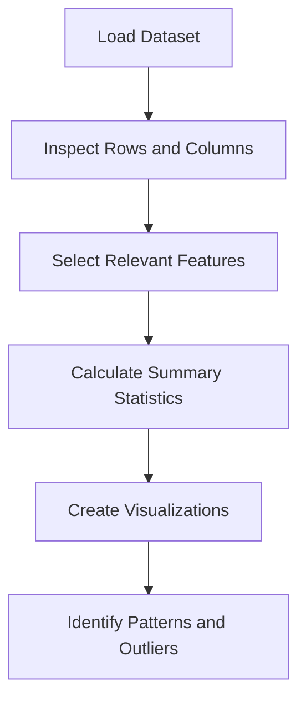

# DAY 17 OF TRAINING

## Exploratory Data Analysis (EDA) — Understanding House Prices

Welcome back to the Industrial Training for AI & Machine Learning!

In this session, we will perform Exploratory Data Analysis (EDA) on the King County house-price dataset. The dataset contains information about houses, including their prices, number of bedrooms and bathrooms, living area, floors, waterfront availability, construction year, and condition.

Our main objective is to explore the dataset, understand its structure, calculate summary statistics, and visualize the distribution of house prices and bedroom counts.

Exploratory Data Analysis is an important step in a machine learning project because it helps us understand the data before using it to train a model.

---

## Learning Objectives

By the end of this session, you will be able to:

* Understand the concept and importance of EDA.
* Load a CSV dataset using Pandas.
* Select relevant columns for analysis.
* Examine dataset dimensions and column names.
* Generate descriptive statistics using Pandas.
* Visualize house-price distribution using a histogram.
* Analyze bedroom counts and identify unusual observations.

---

## What is Exploratory Data Analysis (EDA)?

Exploratory Data Analysis is the process of examining and summarizing a dataset using statistical methods and visualizations. It helps identify patterns, missing values, unusual observations, and relationships between variables.

EDA allows us to understand the quality and characteristics of data before applying machine learning algorithms.

### Importance of EDA

* **Understanding data:** Helps us learn what each column represents.
* **Finding patterns:** Reveals trends and distributions in the dataset.
* **Detecting outliers:** Identifies unusual values that may require investigation.
* **Checking data quality:** Helps locate missing or inconsistent values.
* **Preparing for machine learning:** Supports feature selection and data cleaning.

### Basic EDA Workflow



---

## 1. Loading the Required Libraries

We use Python libraries to load, analyze, and visualize the data.

* **Pandas:** Used for reading CSV files and manipulating tabular data.
* **NumPy:** Provides numerical operations and mathematical functions.
* **Matplotlib:** Used to create charts and graphs.
* **Seaborn:** Provides statistical visualizations with attractive styles.

### Python Code

```python
import pandas as pd
import numpy as np
import matplotlib.pyplot as plt
import seaborn as sns
```

---

## 2. Loading the House-Price Dataset

The dataset is stored in a CSV file named `kc_house_data.csv`. We use Pandas' `read_csv()` function to load it into a DataFrame.

A DataFrame is a two-dimensional data structure containing rows and columns.

### Python Code

```python
df = pd.read_csv("kc_house_data.csv")

print(f"Dataset contains {df.shape[0]} houses")
print(f"Number of columns: {df.shape[1]}")

print(df.head())
```

### Output

The dataset is loaded into a DataFrame. The output displays the number of rows and columns and previews the first five records.

**Note:** Keep `kc_house_data.csv` in the same working directory as the notebook, or provide its correct file path.
---

## 3. Examining Dataset Columns

A dataset may contain many columns, some of which are not required for our initial analysis. Examining column names helps us understand the available features.

### Python Code

```python
print(df.columns)
```

### Output

The names of all columns present in the original dataset are displayed.

---

## 4. Selecting Relevant Features

The original dataset contains several features. For this analysis, we select eight features that are easier to interpret.

| Feature       | Description                         |
| ------------- | ----------------------------------- |
| `price`       | Price of the house                  |
| `bedrooms`    | Number of bedrooms                  |
| `bathrooms`   | Number of bathrooms                 |
| `sqft_living` | Interior living area in square feet |
| `floors`      | Number of floors                    |
| `waterfront`  | Indicates waterfront availability   |
| `yr_built`    | Year the house was built            |
| `condition`   | House condition rating              |

The `price` column is the target variable for our house-price analysis, while the remaining columns describe house characteristics.

### Python Code

```python
friendly_cols = [
    "price",
    "bedrooms",
    "bathrooms",
    "sqft_living",
    "floors",
    "waterfront",
    "yr_built",
    "condition"
]

df = df[friendly_cols]

print(df.head())
```

### Output

The DataFrame now contains only the eight selected columns, making the dataset easier to understand and analyze.

---

## 5. Generating Descriptive Statistics

Descriptive statistics summarize the main characteristics of numerical data. Pandas provides the `describe()` function to calculate these statistics.

The output generally includes:

* **Count:** Number of non-missing values.
* **Mean:** Average value.
* **Standard deviation:** Measure of data spread.
* **Minimum:** Smallest value.
* **25%, 50%, and 75%:** Quartiles, with the 50th percentile representing the median.
* **Maximum:** Largest value.

### Python Code

```python
print(df.describe())
```

### Output

A statistical summary of the selected numerical columns is displayed. It helps us understand typical house prices, living areas, bedroom counts, and the ranges of the selected features.

### Checking Dataset Information

The `info()` function displays column names, data types, non-null counts, and memory usage.

```python
df.info()
```

**Observation:** Dataset information helps us determine whether columns have missing values and whether their data types are appropriate for analysis.

---

## 6. Visualizing House-Price Distribution — Histogram

A histogram represents the frequency distribution of numerical data. It groups values into intervals called bins and displays the number of observations within each interval.

In this example, we visualize house prices using Seaborn's `histplot()` function. The `kde=True` parameter adds a smooth density curve that helps illustrate the overall distribution.

### Python Code

```python
plt.figure(figsize=(10, 5))

sns.histplot(
    data=df,
    x="price",
    kde=True,
    bins=50,
    color="red"
)

plt.title(
    "The Price Mountain: How House Prices are Distributed",
    fontsize=14
)
plt.xlabel("Price ($)", fontsize=12)
plt.ylabel("Number of Houses", fontsize=12)

plt.show()
```

### Output — House-Price Histogram 


The graph displays house prices on the horizontal axis and the number of houses on the vertical axis. The KDE curve shows the approximate shape of the price distribution.

**Observation:** House-price datasets commonly contain many observations in lower and middle price ranges and fewer very expensive houses. A long right tail may indicate the presence of high-priced properties.

---

## 7. Analyzing Bedroom Counts — Count Plot

A count plot displays the number of observations belonging to each category. Here, we use it to examine how many houses have different numbers of bedrooms.

This visualization also helps identify unusual bedroom counts that may require further investigation.

### Python Code

```python
plt.figure(figsize=(10, 5))

sns.countplot(
    data=df,
    x="bedrooms",
    hue="bedrooms",
    palette="Set2",
    legend=False
)

plt.title(
    "Bedroom Counts: How Many Rooms Do People Want?",
    fontsize=14
)
plt.xlabel("Number of Bedrooms", fontsize=12)
plt.ylabel("Number of Houses", fontsize=12)

plt.show()
```

### Output — Bedroom Count Plot

The graph displays the frequency of houses for each bedroom count.

**Observation:** The count plot helps identify the most common bedroom configurations and reveals whether extremely large bedroom counts occur infrequently.


---

## 8. Identifying Houses with More Than 10 Bedrooms

Outliers are observations that differ substantially from the majority of the dataset. They may represent genuine unusual cases or values that need additional checking.

The notebook identifies houses with more than 10 bedrooms using a filtering condition.

### Python Code

```python
giant_outlier = df[df["bedrooms"] > 10]

print(
    f"Look! We found {len(giant_outlier)} "
    "house(s) with more than 10 bedrooms!"
)

print(giant_outlier)
```

### Output

The number of houses with more than 10 bedrooms and their corresponding records are displayed.

**Observation:** The notebook specifically investigates unusually large bedroom counts, including the possibility of a house with 33 bedrooms. Such observations should be examined before deciding whether they need special treatment.

An unusual value should not automatically be deleted because it may represent a genuine property.

---

## Conclusion

In this session, we performed the initial stages of Exploratory Data Analysis on the King County house-price dataset. We loaded the dataset, selected relevant features, examined descriptive statistics, and visualized house prices and bedroom counts.

We also identified houses with unusually high bedroom counts. These activities helped us understand the structure, distribution, and quality of the data.

The analysis provides a foundation for the next session, where we will explore relationships between house features and prices using scatter plots, box plots, bar plots, and correlation heatmaps.

---
