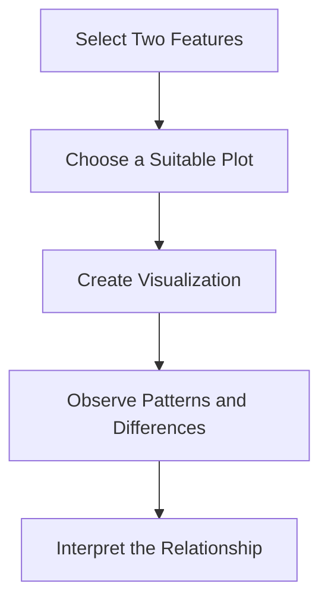

# DAY 18 OF TRAINING

## Exploratory Data Analysis — Relationships Between House Features and Prices

Welcome to the next session of Industrial Training for AI & Machine Learning!

In this session, we will continue analyzing the King County house-price dataset. After understanding its structure and individual feature distributions, we will investigate how different house characteristics are associated with house prices.

We will use scatter plots, box plots, bar plots, and correlation heatmaps to explore the relationships between house size, waterfront availability, house condition, and price.

These visualizations are useful for discovering patterns and selecting features for future machine learning models.

---

## Learning Objectives

By the end of this session, you will be able to:

* Understand bivariate analysis.
* Visualize the relationship between house size and price.
* Compare prices of waterfront and non-waterfront houses.
* Explore the relationship between house condition and average price.
* Understand correlation coefficients.
* Create a correlation heatmap.
* Save the filtered dataset for future analysis.

---

## What is Bivariate Analysis?

Bivariate analysis is the process of examining two variables together to understand whether a relationship exists between them.

For example, we can investigate whether houses with larger living areas tend to have higher prices or whether houses with waterfront views have different price distributions.

### Common Techniques for Bivariate Analysis

| Visualization       | Purpose                                                               |
| ------------------- | --------------------------------------------------------------------- |
| Scatter plot        | Examines the relationship between two numerical variables             |
| Box plot            | Compares distributions across categories                              |
| Bar plot            | Compares an aggregate value, such as average price, across categories |
| Correlation heatmap | Displays correlation coefficients between numerical features          |

### Bivariate Analysis Workflow



---

## 1. House Size vs. Price — Scatter Plot

A scatter plot displays individual observations as points on a two-dimensional graph. It is commonly used to explore the relationship between two numerical variables.

In this analysis:

* The X-axis represents living area in square feet.
* The Y-axis represents house price.
* The `waterfront` feature is used to distinguish points by waterfront availability.

If points tend to rise from left to right, it suggests that larger living areas are generally associated with higher prices.

### Python Code

```python
plt.figure(figsize=(10, 6))

sns.scatterplot(
    data=df,
    x="sqft_living",
    y="price",
    hue="waterfront"
)

plt.title(
    "Size vs Price: Does a Larger House Cost More?",
    fontsize=14
)
plt.xlabel("House Size (Square Feet)", fontsize=12)
plt.ylabel("Price ($)", fontsize=12)

plt.show()
```

### Output — Size vs. Price Scatter Plot

The graph displays each house as a point based on its living area and price. Different colors indicate whether the property has a waterfront view.

**Observation:** The notebook highlights the relationship between house size and price. A general upward trend suggests that houses with larger living areas tend to have higher prices. However, the price also depends on other features, such as location, condition, and waterfront availability.

---

## 2. Waterfront Houses vs. Price — Box Plot

A box plot summarizes a numerical distribution using the median, quartiles, whiskers, and potential outliers.

The `waterfront` feature indicates whether a house has a waterfront location:

* `0` represents no waterfront.
* `1` represents waterfront availability.

A box plot allows us to compare the price distributions of these two groups.

### Python Code

```python
plt.figure(figsize=(8, 5))

sns.boxplot(
    x="waterfront",
    y="price",
    data=df,
    hue="waterfront",
    palette="pastel"
)

plt.title(
    "Waterfront View vs. Price: Is Lake-Side Living Expensive?",
    fontsize=14
)

plt.xticks(
    [0, 1],
    ["No waterfront", "Waterfront"]
)

plt.xlabel("House Location")
plt.ylabel("Price ($)")
plt.ticklabel_format(style="plain", axis="y")

plt.show()
```

### Output — Waterfront vs. Price Box Plot

The graph compares the price distributions of waterfront and non-waterfront houses. The median line indicates the middle price of each group, while the box represents the interquartile range.

**Observation:** The notebook investigates whether waterfront houses tend to be more expensive. Differences in the medians and overall distributions help assess this pattern. High-price outliers may appear in either group.

---

## 3. House Condition vs. Average Price — Bar Plot

The condition feature represents the recorded condition of a house on a scale from 1 to 5, where 1 indicates a poor condition and 5 indicates an excellent condition.

A bar plot can compare the average house price across these condition ratings. Seaborn's `barplot()` calculates an aggregate statistic, which is the mean by default.

### Python Code

```python
plt.figure(figsize=(8, 5))

sns.barplot(
    x="condition",
    y="price",
    data=df,
    hue="condition",
    palette="coolwarm"
)

plt.title(
    "House Condition vs. Price: Do Better-Maintained Houses Sell for More?",
    fontsize=14
)

plt.xlabel("House Condition Rating (1 to 5)")
plt.ylabel("Average Price ($)")
plt.ticklabel_format(style="plain", axis="y")

plt.show()
```

### Output — Condition vs. Average Price Bar Plot

The graph displays the average house price for each condition rating. Each bar represents the mean price of houses belonging to that category.

**Observation:** The chart helps compare average prices across condition categories. The relationship may not increase uniformly with every condition rating, so the actual bar heights should be examined before drawing conclusions.

---

## 4. Understanding Correlation

Correlation measures the strength and direction of the linear relationship between two numerical variables. Its coefficient generally ranges from -1 to +1.

* **Positive correlation:** The variables tend to increase together.
* **Negative correlation:** One variable tends to decrease as the other increases.
* **Near-zero correlation:** There is little or no linear relationship.

A strong correlation indicates an association, but it does not prove that one variable causes the other to change.

For example, house size and house price may be positively correlated because larger properties often have higher prices. However, this does not mean size is the only factor affecting price.

---

## 5. Creating a Correlation Heatmap

A correlation heatmap uses colors to represent correlation coefficients between numerical features. It makes it easier to identify strong positive and negative relationships within a dataset.

The `corr()` function calculates the correlation matrix, while Seaborn's `heatmap()` function displays it.

### Python Code

```python
plt.figure(figsize=(10, 8))

correlation_map = df.corr()

sns.heatmap(
    correlation_map,
    annot=True,
    cmap="coolwarm",
    linewidths=0.5,
    vmin=-1,
    vmax=1
)

plt.title(
    "The Magic Connection Map (Correlation Heatmap)",
    fontsize=16
)

plt.show()
```

### Output — Correlation Heatmap

The heatmap displays correlation coefficients between the selected numerical features. The numerical values inside the cells show the strength and direction of each linear relationship.

**Interpretation:**

* Values closer to `+1` indicate strong positive linear relationships.
* Values closer to `-1` indicate strong negative linear relationships.
* Values closer to `0` indicate weak linear relationships.

### Key Discoveries from the Notebook

1. **House size matters:** The notebook reports a correlation of approximately `+0.70` between its house-size feature and price. The selected dataset column is named `sqft_living`.
2. **Waterfront relationship:** The notebook reports that waterfront houses tend to be more expensive. This pattern can be explored using the waterfront box plot.
3. **Unusual observations:** The dataset contains extreme bedroom counts, including the possibility of a 33-bedroom house. These values should be investigated during data cleaning.

The reported correlation of `+0.70` comes from the notebook's summary. The exact value should be checked against the correlation matrix generated from the selected columns.

---

## 6. Checking Missing Values

Before saving the dataset for later analysis, it is useful to check whether any selected features contain missing values.

The `isnull().sum()` expression counts missing values in every column.

### Python Code

```python
print(df.isnull().sum())
```

### Output

The number of missing values in each selected column is displayed. This helps determine whether further data-cleaning steps are needed.

---

## 7. Saving the Filtered Dataset

After selecting relevant columns and completing the initial exploratory analysis, we save the filtered dataset in a new CSV file.

Saving the processed data allows us to reuse it in future sessions without repeating the feature-selection step.

### Python Code

```python
df.to_csv("kc_house_filtered.csv", index=False)

print("Filtered dataset saved successfully!")
print(df.columns)
```

### Output

The filtered dataset is saved as `kc_house_filtered.csv` in the current working directory. The selected column names are also displayed.

The `index=False` parameter prevents Pandas from writing the DataFrame index as an additional CSV column.

---

## Conclusion

In this session, we explored relationships between house features and prices using bivariate analysis. We used a scatter plot to study living area against price, a box plot to compare waterfront and non-waterfront houses, and a bar plot to examine average price across condition ratings.

We also calculated and visualized correlations using a heatmap, checked missing values, and saved the filtered dataset for future use.

These techniques help identify useful patterns, understand relationships between features, and prepare data for subsequent machine learning tasks.

---
